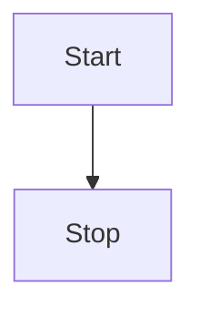

RIasC, an acronym for **R**esearch **I**nfrastructure **as** **C**ode, is a framework to accelerate distributed Research Infrastructure (RI) experiments.

Inspired by the Infrastructure-as-Code paradigm it achieves this by a high degree of automation of common tasks in a research environment such as:

- Rapid deployment of controllers and other services in a research/laboratory cloud
- Network setup and VPN configuration
- Logging of research data
- Formalization and declarative description of research setups

Infrastructure as code (IaC) is the process of managing and provisioning computer data centers through machine-readable definition files, rather than physical hardware configuration or interactive configuration tools.
The IT infrastructure managed by this process comprises both physical equipment, such as bare-metal servers, as well as virtual machines, and associated configuration resources.
The definitions may be in a version control system.
It can use either scripts or declarative definitions, rather than manual processes, but the term is more often used to promote declarative approaches.

RIasC realizes this by utilizing existing cloud-computing technologies and applying them in a research environment.

## Functions

RIasC provides the following functionalities to accelerate distributed Research Infrastructure (RI) experiments.

###  Transparent inter-laboratory overlay network

Research of highly complex systems such as for example todays energy systems is increasingly undertaken by a group of researchers and institutions.
Consequently, it is desirably to perform distributed experiments spanning multiple laboratories.
RIasC simplifies the setup of such distributed setups by providing a transparent IP overlay network between all trial sites.

### Network emulation

### Interfaces to laboratory equipment outside of the cloud

### Network policies to implement access control to resources with the cloud and the laboratory

## Worklow

## Architecture

The following figure illustrates an exemplary setup of RIasC.

<figure align="center">
    
    <figcaption>Architecture.</figcaption>
</figure>

In this case three laboratories are coupled via a distributed Kubernetes cloud.
RIasC uses K3S as its Kubernetes distribution which is optimized for lighweight deployments on _edge_ devices which run the K3S _agent_ process.
In our case we also refer to the _agent_ nodes as _mobile units (MU)_.
Each laboratory hosts one or more _mobile units_ which automatically join themself into the cloud.

To deploy a mobile unit an existing desktop or server workstation could be used.
But also more lightweight single board computers like the Raspberry can be used.

The requirements for running a K3S _agent_ are relatively low.
Both Intel/AMD x86 and ARM architectures supported.
K3S has no other external dependencies besides the Linux kernel.
This is a main factor to simplify the whole deployment of new nodes.

Please refer to the [agent setup](./setup/agent/index.md) for more information.

### Services

RIasC relies on a collection of existing software tools and projects.
It combines these tools by providing reference examples and configurations benefiting researchs by a simpler and approachable access to cloud technologies.

Currently to following existing tools are deployed by RIasC:

- [Kubernetes](http://kubernetes.io/)
  - [K3S](http://k3s.io/)
  - [Kilo](https://github.com/squat/kilo)
    - [Wireguard](https://wireguard.com/)
- [Linux traffic control / netem](https://wiki.linuxfoundation.org/networking/netem)
- [VILLASframework](https://fein-aachen.org/projects/villas-framework/)
- [Power System Automation Language(PSAL)](https://www.mdpi.com/1996-1073/10/3/374/htm)

<figure align="center">
    
    <figcaption>Software Stack.</figcaption>
</figure>

### Concept

#### Kubernetes

<figure align="center">
    
    <figcaption>Kubernetes Cluster.</figcaption>
</figure>

#### Operators

<figure align="center">
    
    <figcaption>Kubernetes Operators.</figcaption>
</figure>

<figure align="center">
    
    <figcaption>Operator Reconciliation.</figcaption>
</figure>

## Credits

RIasC is developed as part of the [European H2020 project ERIGrid 2.0](https://erigrid2.eu) in the work package JRA2.2 "Real-time coupling and HIL approaches".
Contributing partners are:

- Insitute for Automation of Complex Power Systems (ACS) at RWTH Aachen University
- Austrian Institute for Technology (AIT)
- VTT Technical Research Centre of Finland Ltd.
