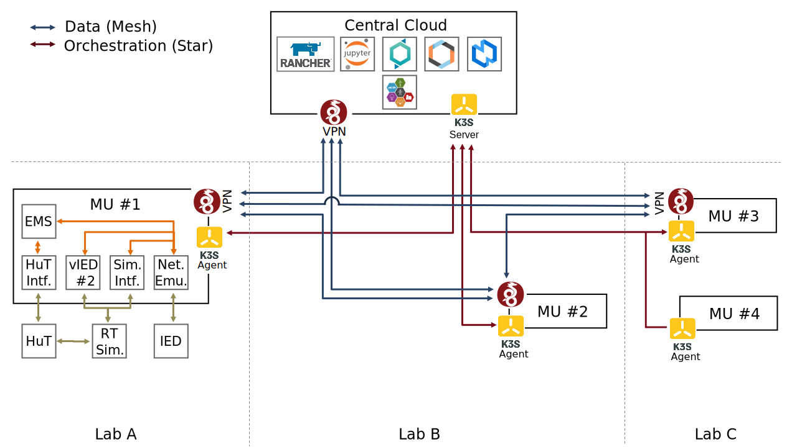

RIasC, an acronym for **R**esearch **I**nfrastructure **as** **C**ode, is a cloud-based platform to accelerate distributed Research Infrastructure (RI) experiments.

It achieves this by a high degree of automation of common tasks in a research environment such as:

- Rapid deployment of controllers and other services in a research cloud
- Network setup and VPN configuration
- Logging of research data
- Formalization of scenario descriptions

## Functions

- Transparent inter-lab overlay network
- Network emulation between all components
- Interfaces to lab equipment outside of the cloud
- Network policies to implement access control to resources with the cloud and the lab

## Architecture

The following figure illustrates an exemplary setup of RIasC.

In this case three laboratories are coupled via a distributed Kubernetes cloud.
RIasC uses K3S as its Kubernetes distribution which is optimized for lighweight deployments on _edge_ devices which run the K3S _agent_ process.
In our case we also refer to the _agent_ nodes as _mobile units (MU)_.
Each laboratory hosts one or more _mobile units_ which automatically join themself into the cloud.

To deploy a mobile unit an existing desktop or server workstation could be used.
But also more lightweight single board computers like the Raspberry can be used.

The requirements for running a K3S _agent_ are relatively low.
Both Intel/AMD x86 and ARM architectures supported.
K3S has no other external dependencies besides the Linux kernel.
This is a main factor to simplify the whole deployment of new nodes.

Please refer to the [agent setup](./setup/agent.md) for more information.
### Components

- [Kubernetes](http://kubernetes.io/)
  - [K3S](http://k3s.io/)
  - [Kilo](https://github.com/squat/kilo)
    - [Wireguard](https://wireguard.com/)
- [Linux traffic control / netem](https://wiki.linuxfoundation.org/networking/netem)
- [VILLASframework](https://fein-aachen.org/projects/villas-framework/)
- [Power System Automation Language(PSAL)](https://www.mdpi.com/1996-1073/10/3/374/htm)
