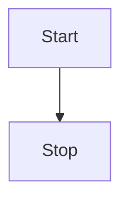

RIasC, an acronym for **R**esearch **I**nfrastructure **as** **C**ode, is a framework to accelerate distributed Research Infrastructure (RI) experiments.

Inspired by the Infrastructure-as-Code paradigm it achieves this by a high degree of automation of common tasks in a research environment such as:

- Rapid deployment of controllers and other services in a research/laboratory cloud
- Network setup and VPN configuration
- Logging of research data
- Formalization and declarative description of research experiments
- Emulation and monitoring of communication network characteristics

Infrastructure as code (IaC) is the process of managing and provisioning computer data-centers through machine-readable definition files, rather than physical hardware configuration or interactive configuration tools.
The IT infrastructure managed by this process comprises both physical equipment, such as bare-metal servers, as well as virtual machines, and associated configuration resources.
The definitions may be in a version control system.
It can use either scripts or declarative definitions, rather than manual processes, but the term is more often used to promote declarative approaches.

RIasC realizes this by utilizing existing cloud-computing technologies and applying them in a research environment.

## Functions

RIasC provides the following functionalities to accelerate distributed Research Infrastructure (RI) experiments.

### Provisioning of Mobile Units

A mobile unit in RIasC's terminology is a mobile computing device acting as a gateway between laboratory equipment and other possible remote laboratories.
The setup and maintenance updates of the units is handled by RIasC to alleviate the researcher from a manual setup of these devices.

### Deployment of Containerized Software Components

The mobile units run a Linux operating system and join a Kubernetes cluster which is consists of all the mobile units.
This Kubernetes clusters allows the research to declaratively describe the setup of software components which are executed as containerized applications on the cluster.

### Transparent Inter-laboratory Overlay Network

Research of highly complex systems such as for example todays energy systems is increasingly undertaken by a group of researchers and institutions.
Consequently, it is desirably to perform distributed experiments spanning multiple laboratories.
RIasC simplifies the setup of such distributed setups by providing a transparent IP overlay network between all participating laboratories.

### Time Synchronization

For geographically distributed real-time simulation (GD-RTS) a common time-base is required in order to synchronize the simulation of coupled subsystems as well as the proper temporal alignment of simulation results.
A time-synchronization service provides this common time-base by synchronizing the clock of each mobile-unit via one of the supported synchronization sources.
The RIasC time-synchronization currently supports the Global Positioning System (GPS), the Network Time Protocol (NTP) or the Precision Time Protocol (PTP) as synchronization sources.

### Network Emulation

Network emulation allows for a realistic emulation of real-world network characteristics.
RIasC provides a network emulation service which allows the researcher to declaratively describe desired network parameters such as communication delay, packet loss, throughput etc.

### Network Monitoring

I a geographically distributed experiment which possible spans across multiple laboratories, network charactersitics are also affected by the communication link between the sites.
In many cases this is the public Internet and/or the national research networks.
These networks are shared mediums and as such can exhibit congestion and unpredictable latencies and packet loss.
RIasC aims at counteract these effects by providing a network monitoring service which monitors the network conditions between a configurable set of mobile-units.
In a similar manner as the network emulation configuration, these scheduling of these monitoring tests can be configured declaratively.

## Worklow

## Architecture

The following figure illustrates an exemplary setup of RIasC.

<figure align="center">
    
    <figcaption>Architecture.</figcaption>
</figure>

In this case three laboratories are coupled via a distributed Kubernetes cloud.
RIasC uses K3S as its Kubernetes distribution which is optimized for lightweight deployments on _edge_ devices which run the K3S _agent_ process.
In our case we also refer to the _agent_ nodes as _mobile units (MU)_.
Each laboratory hosts one or more _mobile units_ which automatically join them self into the cloud.

To deploy a mobile unit an existing desktop or server workstation could be used.
But also more lightweight single board computers like the Raspberry can be used.

The requirements for running a K3S _agent_ are relatively low.
Both Intel/AMD x86 and ARM architectures supported.
K3S has no other external dependencies besides the Linux kernel.
This is a main factor to simplify the whole deployment of new nodes.

Please refer to the [agent setup](./setup/agent/index.md) for more information.

### Services

RIasC relies on a collection of existing software tools and projects.
It combines these tools by providing reference examples and configurations benefiting researchs by a simpler and approachable access to cloud technologies.

Currently to following existing tools are deployed by RIasC:

- [Kubernetes](http://kubernetes.io/)
  - [K3S](http://k3s.io/)
  - [Kilo](https://github.com/squat/kilo)
    - [Wireguard](https://wireguard.com/)
- [Linux traffic control / netem](https://wiki.linuxfoundation.org/networking/netem)
- [VILLASframework](https://fein-aachen.org/projects/villas-framework/)
- [Power System Automation Language(PSAL)](https://www.mdpi.com/1996-1073/10/3/374/htm)

<figure align="center">
    
    <figcaption>Software Stack.</figcaption>
</figure>

### Concept

#### Kubernetes

<figure align="center">
    
    <figcaption>Kubernetes Cluster.</figcaption>
</figure>

#### Operators

<figure align="center">
    
    <figcaption>Kubernetes Operators.</figcaption>
</figure>

<figure align="center">
    
    <figcaption>Operator Reconciliation.</figcaption>
</figure>

## Credits

RIasC is developed as part of the [European H2020 project ERIGrid 2.0](https://erigrid2.eu) in the work package JRA2.2 "Real-time coupling and HIL approaches".
Contributing partners are:

- Insitute for Automation of Complex Power Systems (ACS) at RWTH Aachen University
- Austrian Institute for Technology (AIT)
- VTT Technical Research Centre of Finland Ltd.
