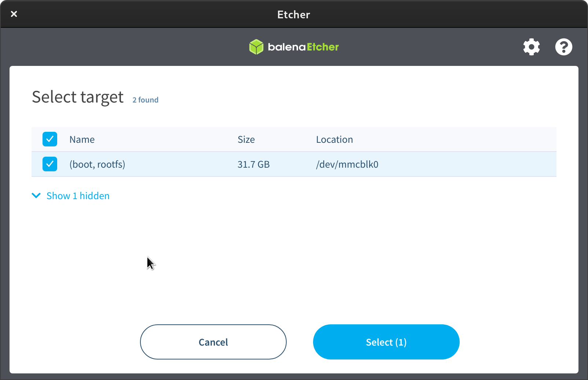

The setup of an Raspberry Pi single-board computer is the easiest way to participate in a RIasC cloud of labs.

## Requirements

- Raspberry Pi 3B / 4
- SD card (>= 16 GB)
- SD card reader
- SD card imager tool (e.g. [Balena Etcher](https://www.balena.io/etcher/))
- [SD card image of RIasC](https://rwth-aachen.sciebo.de/s/7RpsGEl7NEEsvf1/download?path=%2F&files=2021-09-22-riasc-raspios.zip) (~ 500 MB)
- Hostname and token from cluster administrator

## Installation

1. Request a token and hostname from the cluster admin.
   - Note them down. We will need it later.
   - Example:
     - `TOKEN=K109b5813dd9a6944badc430e0e457179e4c83333f882a13ea7356134be77d3508b::server:e851c7e39f5fe771b8b9377c79eaff68`
     - `HOSTNAME=riasc-node-vtt`
2. Use your SD card imager tool of choice  to write the image to a spare SD card.
   - If asked use the following link as a URL for downloading the image: `https://rwth-aachen.sciebo.de/s/7RpsGEl7NEEsvf1/download?path=%2F&files=2021-09-22-riasc-raspios.zip`
3. Re-insert the SD card reader and open the `boot` partition of the SD card.
4. Adjust the [riasc.yaml](config.md) file inside this partition:
   - Adjust the the settings `hostname` and `ansible.variables.token` with the values from step 1.
   - Relevant locations are marked with `# changeme!` inside the file.
5. Insert the SD card in the Raspberry Pi and power it on.
6. Wait until provisioning completes.
   - The first boot will take a while (> 10 minutes)
   - You can follow the process by attaching a screen to the Raspberry Pi
   - ..or run the following command after login via SSH: `sudo journalctl -fu riasc-update`   
   - The Raspberry Pi will reboot several times during the process.
   - Once finished the the console should print `RIasC update completed successfully!`
7. Verify that the node has been provisioned successfully:
   1. Login to the Raspberry Pi with the standard credentials via console:
     - User: `pi`
     - Password: `raspberry`
     - Login via SSH is also possible
   2. Check the status of the `riasc-update` service by running the following command: `sudo systemctl status riasc-update`
8. Change the default password:
   - Run the `passwd` command and follow the instructions

## Screenshots

